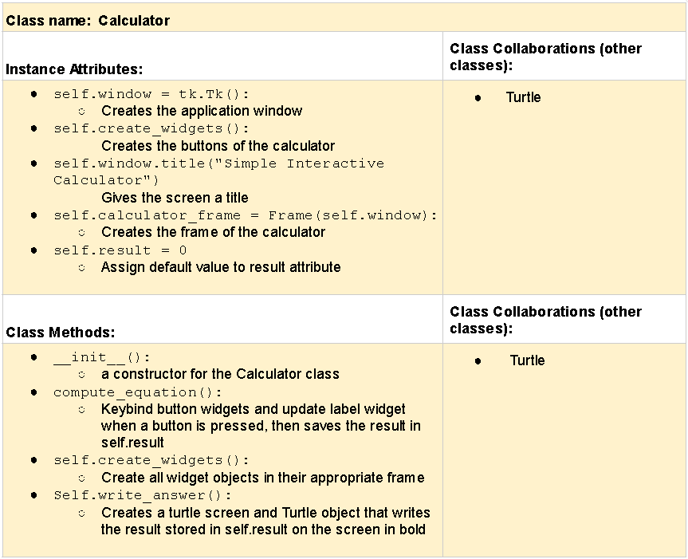

# CSC226 Final Project

**Author(s)**: Tafreed Sardar, Hope Michael

**Google Doc Link**: https://docs.google.com/document/d/1UKZfv3geGkOdmvUdQ1jIEGk3vvioOPGFC-actVCHqDw/edit?usp=sharing

---

## Milestone 1: Setup, Planning, Design

**Title**: `Interactive Calculator`

**Purpose**: `Building an interactive calculator.`
 
**Source Assignment(s)**: `RQ18: Chapter 15: Event Driven Programming and GUIs`

**CRC Card(s)**:
  


**Branches**:  

```
    Branch 1 starting name: sardart
    Branch 2 starting name: michaelh2
    Branch 3 starting name: completed_final_project
```

### References 

Julio Jijon

Sami

https://stackoverflow.com/questions/44634947/how-to-set-a-turtle-to-a-turtle-screen/44639041#44639041

https://www.w3schools.com/python/ref_func_eval.asp

---

## Milestone 2: Code Setup and Issue Queue

```
    So far we have completed milestone 1 and created a unittest file and the main file to write our code. We are pretty 
    confident in the direction we want to take our code in, so we are feeling satisfied. Understanding issues in github
    was a little complicated, but in the end we were able to figure it out. Because we have not yet been taught how to test
    classes using classes, we are using the basic approach taught in class. Our next steps are working on the issues on github.
    We are confident in our ability to maneuver other issues that will arise.
```
---

## Milestone 3: Virtual Check-In

**Completion Percentage**: 90%

**Confidence**: 

```
    We are sure that we can complete this Python calculator project since we have a solid understanding of fundamental 
    Python syntax, functions, and control structures, which will be the building blocks of building a calculator. To 
    increase the probability of the project being completed on schedule, we broke down the job into small manageable 
    tasks such as user interface designing, testing and coding each operation (addition, subtraction, etc.), so that we 
    can see how much work has been accomplished. Additionally, we will ask for help if needed, and allocate regular 
    time each day to work on the project.
```

---

## Milestone 4: Final Code, Presentation, Demo

### User Instructions

The calculator starts in 'CAL' mode which means it functions like a regular calculator. The user can enter simple math 
problems using the buttons on screen and click the '=' button to show the FINAl result, as the result is actively displayed 
each time the user enters an integer value. The user can toggle between 'CAL' and 'GAME' mode by clicking the 'MODE' button.
When in 'GAME' mode, the user is given an equation to solve by entering the missing values on the black line. The user 
enters the missing values by clicking the number buttons. As this is a simple program, when in 'GAME' mode, equation sign
and parenthesis buttons are disabled. The user clicked the '=' sign button to view if their answer is right or wrong.
clicking the 'RESET' or the 'MODE' button twice, displays a new equation.

### Reflection

Each partner should write three to four well-written paragraphs address the following (at a minimum):
- Why did you select the project that you did?
- How closely did your final project reflect your initial design?
- What did you learn from this process?
- What was the hardest part of the final project?
- What would you do differently next time, knowing what you know now?
- How well did you work with your partner? What made it go well? What made it challenging?

```
    Partner 1: We chose to work on the Python calculator project because it gave us a hands-on way to apply everything we 
    have been learning this semester. The idea of combining a basic calculator with a game mode made the project 
    more interesting. At first, we thought about using Turtle graphics to display the result in a fun way, but 
    after trying it out, we realized it did not add much value/uniqueness. We decided to focus on making the calculator 
    function well and give users a chance to practice their math skills through an interactive game instead.
    
    The final version of our project was pretty close to our original design. We planned for two modes: a regular 
    calculator and a game that gives the user a missing-value equation to solve. Both features were completed, 
    and we were able to make the mode switching work smoothly. We scrapped the Turtle idea early and put more 
    time into getting the calculator to display results in real time. Our goal was to make the user interface 
    clear and simple, and I think we succeeded in doing that. In the end, we created a calculator that works 
    well and offers something a little extra, just like you wanted Scott:).
    
    This project taught me a lot about writing clean code, using Tkinter, and managing user input carefully. 
    I also saw how important it is to test as we go. Some of the harder parts were dealing with edge cases 
    in the calculator and making sure the game mode did not break when given odd input. We tried to keep 
    the program from crashing by using try-except blocks and limiting what users could enter at different 
    points. Looking back, I would write more helper functions to organize the code better and maybe try 
    an alternative to using eval for safety.
    
    Working with my partner went well overall. We split up the work, used Git branches, and kept in touch regularly to avoid 
    stepping on each other’s code (see what i did there?:)). GitHub really helped us stay organized, though we had a few small 
    merge issues when accidentall working on the same thing. What helped the most was our consistent communication: leaving 
    clear comments, helping each other understand difficult concepts, and setting workable/SMART goals for each milestone. 
    Our teamwork made the project less stressful, and we both contributed to building something we are proud of.
    
```

```
    Partner 2: I chose to create a Python calculator for our project because it offered a practical way to apply the 
    programming skills we’ve been learning, while still being manageable within the time frame. A calculator is a useful 
    tool and gave us the opportunity to explore fundamental programming concepts like functions, conditionals, loops, 
    and error handling. We also wanted to challenge ourselves by making it more than just a calculator—adding features 
    like input validation and an arithmetic computation game. This project was simple, yet it tested my python skills.

    The project stayed pretty close to the initial design, especially when it came to the underlying functionality. We 
    wanted to have simple operations such as addition, subtraction, multiplication, and division, and managed to get 
    all of them done. While we did consider adding a Turtle initially, we decided to concentrate on a clean, functional 
    version first, so we could have a solid project before going into extra features. This adjustment in scope allowed 
    us to narrow our focus and complete a stable version of the calculator without overcomplicating the development 
    process. Later on, we decided to add a game which tests one's mathematical skills by providing mathematical 
    equations to complete.

    Over the course of the project, I learned a lot — not only about Python, but about planning, troubleshooting, and 
    teamwork. I focused more on each function to maintain code structure and thorough testing to prevent bugs. We 
    learned how important it is to divide a project into smaller pieces and develop iteratively. One of the challenging 
    aspects of the project was handling edge cases such as dividing by zero. It took some trial and error to ensure the 
    calculator provided good error messages for these.

    Having a partner to work on this project was a good experience overall. One of the challenges we faced was 
    coordinating our schedules to work at the same time, but we managed to overcome this by using common files and 
    leaving clear notes for each other. Working together as partners went smoothly overall. We left comments, and pushed 
    updates without needing to be online at the same time. What made the collaboration effective was our consistent 
    communication, and mutual respect for each other’s ideas and time. The main challenge was occasionally merging 
    different versions of files, but we learned how to manage branches and resolve conflicts. 
```

---